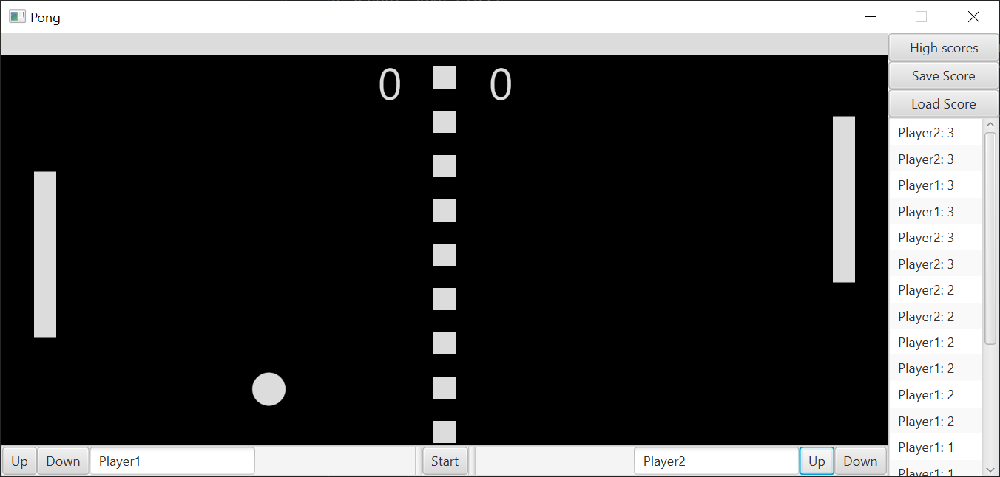

# Pong Game

This project is a simple implementation of the classic Pong game, developed during my early Java learning experience in
a school Java class.

- The project has a basic and unattractive UI with significant room for improvement.
- Paddle movement currently relies on clicking buttons (up/down), which could be enhanced with better controls.
- Scores are saved and loaded using Apache Derby DB.
- This project serves more as a demonstration rather than a fully functional game.

## Prerequisites

- **JDK 17 or higher**
- **Apache Maven**
- **Apache Derby DB**

